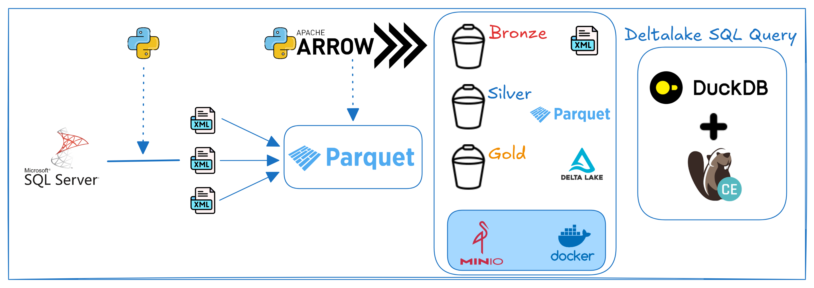
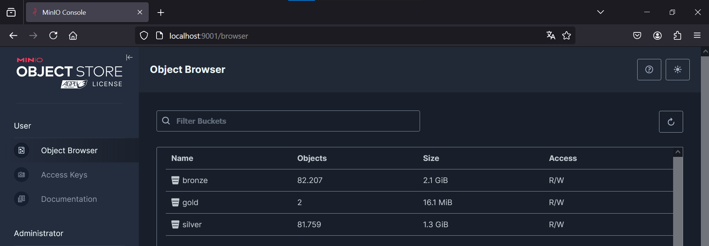
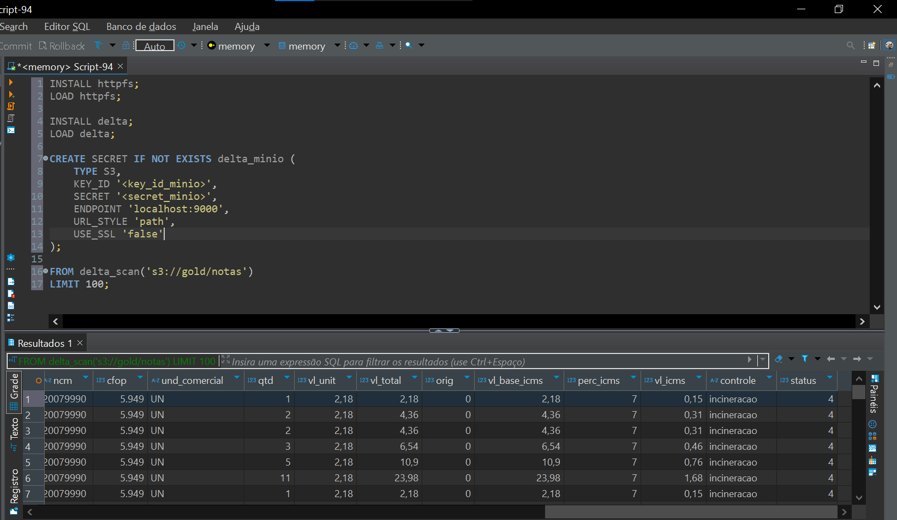

# Pipeline de Dados com Camadas Bronze, Silver e Delta Lake Gold para Exportação de XML do SQL Server ao MinIO

O objetivo deste projeto de engenharia de dados é extrair informações em formato XML referente a notas fiscais eletrônicas (NFE) de um banco de dados SQL Server, processá-las e armazená-las em um sistema de armazenamento baseado no MinIO, organizando os dados em três camadas: Bronze, Silver e Gold. Cada camada tem um propósito específico no ciclo de vida dos dados, visando transformar dados brutos em informações úteis e prontas para análise, de maneira escalável e eficiente.



## Tecnologias utilizadas

| Tecnologia        | Função Principal                                             |
|-------------------|--------------------------------------------------------------|
| **Python**        | Linguagem principal para desenvolvimento do pipeline         |
| **PyODBC**        | Conectar e extrair dados XML do SQL Server                   |
| **lxml**          | Processar e validar dados XML                                |
| **Pandas**        | Manipular e transformar dados nas camadas Silver             |
| **PyArrow**       | Manipular e converter dados para Parquet                     |
| **Delta Lake**    | Armazenar dados na camada Gold com suporte a transações ACID |
| **Boto3**         | Interagir com o MinIO para upload/download de arquivos       |
| **S3/MinIO**      | Sistema de armazenamento distribuído compatível com S3       |
| **Docker**        | Gerenciamento de contêineres para garantir ambiente isolado  |
| **DuckDB**        | Consultar e ler dados de tabelas Delta localmente            |
| **DBeaver**       | Editor SQL para consultas e manipulação de dados             |

## Camadas de Dados

1. **Camada Bronze**
   - **Descrição**: Nesta camada, os dados são armazenados em seu formato bruto, exatamente como foram extraídos da fonte (SQL Server, no caso). Não são realizadas transformações ou limpezas significativas.
   - **Objetivo**: Manter um histórico fiel dos dados originais, preservando a integridade dos dados brutos para permitir rastreamento de qualquer erro ou mudança.
   - **Formato**: Arquivos XML no MinIO.
   - **Exemplo**: 
     ```
     s3://bronze/<controle>/<ano>/<mes>/<dia>/chave_de_acesso_nota.xml
     ```

2. **Camada Silver**
   - **Descrição**: Nesta camada, os dados são processados, limpos e transformados para facilitar a análise. O foco aqui é remover valores nulos, corrigir erros e padronizar o formato dos dados.
   - **Objetivo**: Fornecer uma versão refinada dos dados para que as análises possam ser realizadas sem o peso do processamento de dados brutos.
   - **Formato**: Arquivos Parquet no MinIO.
   - **Exemplo**: 
     ```
     s3://bronze/<controle>/<ano>/<mes>/<dia>/chave_de_acesso_nota.parquet
     ```

3. **Camada Gold**
   - **Descrição**: A camada Gold é onde os dados são agrupados, consolidados e otimizados para consultas analíticas avançadas e relatórios.
   - **Objetivo**: Entregar dados prontos para consumo por ferramentas de BI e dashboards.
   - **Formato**: Delta Lake no MinIO, com suporte a transações ACID e versionamento dos dados.
   - **Exemplo**:
     ```
     s3://gold/notas_fiscais/
     ```

### Estrutura de Dados no MinIO
- **Bronze**: Dados brutos extraídos do SQL Server (XML).
- **Silver**: Dados transformados e limpos (Parquet).
- **Gold**: Dados consolidados e pronto para análise (Delta Lake).

# Resultados

## Armazenamento MinIO



## Consulta SQL Duckdb e DBeaver

